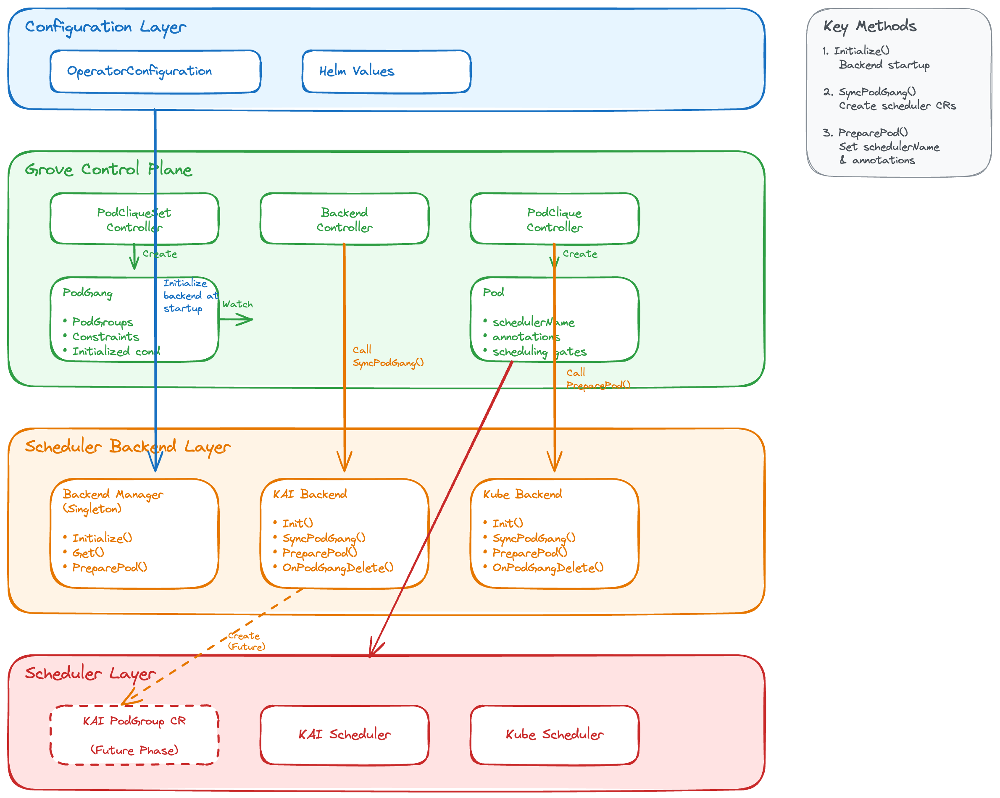

# GREP-375: Scheduler Backend Framework

<!-- toc -->
- [Summary](#summary)
- [Motivation](#motivation)
  - [Goals](#goals)
  - [Non-Goals](#non-goals)
- [Proposal](#proposal)
  - [User Stories](#user-stories)
    - [Story 1: Third-Party Scheduler Integration](#story-1-third-party-scheduler-integration)
    - [Story 2: Multi-Cluster Deployment with Different Schedulers](#story-2-multi-cluster-deployment-with-different-schedulers)
    - [Story 3: Scheudler Migration Path](#story-3-scheudler-migration-path)
  - [Limitations/Risks &amp; Mitigations](#limitationsrisks--mitigations)
    - [Single Active Scheduler Backend](#single-active-scheduler-backend)
    - [Backend API Stability](#backend-api-stability)
    - [Scheduler Capability Mismatch](#scheduler-capability-mismatch)
- [Design Details](#design-details)
  - [Architecture Overview](#architecture-overview)
    - [Layer 1: Configuration Layer](#layer-1-configuration-layer)
    - [Layer 2: Grove Control Plane](#layer-2-grove-control-plane)
    - [Layer 3: Scheduler Backend Layer](#layer-3-scheduler-backend-layer)
    - [Layer 4: Scheduler Layer](#layer-4-scheduler-layer)
  - [Backend Interface Definition](#backend-interface-definition)
  - [Backend Manager](#backend-manager)
  - [OperatorConfiguration Extension](#operatorconfiguration-extension)
  - [PodGang Lifecycle Changes](#podgang-lifecycle-changes)
    - [Previous Flow (Before Framework):](#previous-flow-before-framework)
    - [New Flow (With Framework):](#new-flow-with-framework)
    - [New PodGang Status Condition](#new-podgang-status-condition)
  - [Backend Controller](#backend-controller)
  - [Monitoring](#monitoring)
    - [Status Conditions](#status-conditions)
  - [Test Plan](#test-plan)
    - [Unit Tests](#unit-tests)
    - [E2E Tests](#e2e-tests)
  - [Graduation Criteria](#graduation-criteria)
    - [Alpha](#alpha)
    - [Beta](#beta)
    - [GA](#ga)
- [Implementation History](#implementation-history)
- [Alternatives](#alternatives)
  - [Alternative 1: Direct Scheduler Integration](#alternative-1-direct-scheduler-integration)
<!-- /toc -->

<!--
Include a table of contents as it helps to navigate easily in the document.

Ensure the TOC is wrapped with
   <code>&lt;!-- toc --&gt;&lt;!-- /toc --&gt;</code>
tags, and then generate by invoking the make target `update-toc`.

-->

## Summary

Grove's scheduler API is currently integrated with the KAI scheduler as the only advanced AI scheduler that supports hierarchical gang-scheduling and topology-aware scheduling. While any custom scheduler can integrate with Grove's PodGang scheduling API, the onus remains on the external scheduler to do the heavy lifting of the integration effort. It also becomes difficult to add any scheduler specific logic from the operator. This proposal introduces a Scheduler Backend Framework that standardizes and simplifies the process of adding new scheduler support directly into Grove, making it easier to handle scheduler specific logic in its own backend.

## Motivation
Grove's unified API for AI workloads *training, inference, agents, etc.* allows the Grove operator to realize a workload's scheduling constraints through the PodGang API. Since the PodGang API is specific to Grove, it needs to be translated to constraints that are specific to the backend scheduler. While it is possible for each scheduler to support Grove independently by implementing its own translation layer, it will likely introduce maintenance issues over time as Grove keep evolving its scheduler constraint generation capabilities.

Introducing a Scheduler Backend Framework addresses these challenges by providing:

* **Standardized Integration**: A well-defined interface and abstraction layer that makes adding a new scheduler backend easier and more standardized.
* **Reduced Invasiveness**: Minimal modifications to existing scheduler implementations, allowing schedulers to integrate with Grove through a plugin-like architecture.
* **Improved Scheduling Flow**: A more efficient and streamlined scheduling workflow that clearly separates concerns between Grove's workload management and scheduler-specific placement decisions.
* **Future-Proof Architecture**: A foundation that can adapt to emerging scheduling requirements and new scheduler implementations in the Kubernetes ecosystem.

In summary, refining Grove and introducing a Scheduler Backend Framework is both an urgent and inevitable improvement that will ensure Grove's long-term viability and extensibility in the evolving Kubernetes scheduling landscape.

### Goals

* **Define Scheduler Backend Interface**: Introduce a well-defined Go interface that abstracts scheduler-specific operations, enabling Grove to work with multiple scheduler backends through a standardized contract.
* **Refine PodGang Lifecycle Management**: Optimize the PodGang creation and update workflow to integrate with the Scheduler Backend Framework, allowing scheduler backends to customize pod specifications during reconciliation.
* **Enable Custom Resource Management**: Provide interfaces that allow Scheduler Backends to create, update, and delete their own custom resources in response to PodGang lifecycle events (create, update, delete, status changes).
* **Simplify User Experience**: Allow users to configure their preferred scheduler backend during Grove installation via OperatorConfiguration, eliminating the need to specify schedulerName in every pod specification.
* **Support Dynamic Backend Selection**: Enable Grove to determine which scheduler backend to use based on configuration, with clear mechanisms for backend registration and initialization.
* **Support Multiple Scheduler Backends**: Provide built-in support for multiple scheduler backends including the Kubernetes default-scheduler and KAI scheduler, with a clear path for adding additional third-party schedulers. The framework should enable easy integration of new schedulers as the community support for advanced features (gang scheduling, topology-aware scheduling) evolves.

### Non-Goals

* **Support multiple active schedulers**: It is technically possible to run different schedulers in a Kubernetes cluster as long as care is taken to cleanly segregate Node resources that each scheduler targets to prevent race conditions leading to overbooking of Node resources. This version of the GREP does not provide means to run Grove operator with multiple active schedulers. 


## Proposal

The Scheduler Backend Framework introduces a plugin-like architecture that decouples Grove's workload management from scheduler-specific implementations. The framework consists of three main components:

1. **Interface**: A Go interface defining the contract between Grove and scheduler backends.
2. **Registry**: Mechanism for scheduler backends to register themselves during initialization.
3. **Lifecycle Hooks**: Well-defined points in the PodGang lifecycle where backend schedulers can inject custom logic.

The framework follows an architecture where:
- Grove manages the high-level workflow and `PodGang` lifecycle
- Scheduler backend(s) implement the interface to provide scheduler-specific behavior
- The operator configuration determines which scheduler backend is active at runtime

### User Stories

#### Story 1: Third-Party Scheduler Integration

As a third-party scheduler developer, I want to integrate my custom gang scheduler with Grove without modifying Grove's core codebase. The Scheduler Backend Framework should provide clear interfaces and documentation that allow me to implement a backend plugin for my scheduler, register it with Grove, and have Grove automatically use my scheduler for workload placement decisions.

#### Story 2: Multi-Cluster Deployment with Different Schedulers

As a platform engineer managing multiple Kubernetes clusters, I want to deploy Grove across clusters that use different schedulers (e.g., KAI in production clusters, default scheduler in development clusters). The framework should allow me to configure the appropriate scheduler backend for each cluster through OperatorConfiguration without changing workload specifications or Grove's deployment manifests.

#### Story 3: Scheudler Migration Path

As a cluster administrator, I want to migrate from one scheduler to another (e.g., from a custom scheduler to KAI or vice versa) without significant disruption. The Scheduler Backend Framework should provide a clear migration path where I can update the OperatorConfiguration, restart Grove.

### Limitations/Risks & Mitigations

#### Single Active Scheduler Backend

**Limitation**:
If workload operators wish to have a flexibility to configure different schedulers at `PodCliqueSet` level within the same cluster, then this version of GREP does not offer that capability.

**Mitigation**
Kubernetes clusters typically run with a single scheduler to prevent resource contention across schedulers, unless care is taken to create multiple node pools and each scheduler is exclusively associated with a subset of node pools. In this version of the GREP this limitation is acceptable. Users who require multiple schedulers can run separate Grove installations with different active scheduler backend in each cluster.

**Limitation**:
In the initial implementation, Grove can only be configured with one scheduler backend per deployment. Users cannot mix schedulers for different workloads within the same Grove installation.

**Mitigation**:
This is acceptable for most use cases as clusters typically standardize on a single scheduler. Users requiring multiple schedulers can run separate Grove installations with different configurations in different clusters.

#### Backend API Stability

**Risk**: Changes to the backend interface in future Grove versions could break existing backend implementations.

**Mitigation**:
- Follow semantic versioning for backend interfaces
- Maintain backward compatibility within major versions
- Provide deprecation notices and migration guides for interface changes
- Consider versioned interfaces if breaking changes are necessary

#### Scheduler Capability Mismatch

**Limitation**:
Different schedulers have varying capabilities, which may not align with the uniform capability set exposed through the PodGang API.

**Mitigation**:
- **For Missing Capabilities**: The PodCliqueSet status should surface conditions indicating when requested features are not supported by the configured scheduler backend. This provides clear feedback to users about capability mismatches.
- **For Additional Capabilities**: Document and track scheduler-specific capabilities during the integration process. If a scheduler provides valuable additional features that require configuration, evaluate adding new fields to the PodCliqueSet and PodGang APIs. These API extensions can be implemented incrementally in phases as new schedulers are integrated.

## Design Details

### Architecture Overview

The Scheduler Backend Framework introduces a clean separation between Grove's control plane logic and scheduler-specific implementations. The architecture is organized into four distinct layers:



#### Layer 1: Configuration Layer
User-facing configuration that defines which scheduler backend to use:
- **OperatorConfiguration**: Kubernetes CR with `schedulerName` field
- **Helm Values**: Deployment-time configuration (`config.schedulerName`)

#### Layer 2: Grove Control Plane
Core controllers managing Grove workload lifecycle:
- **PodCliqueSet Controller**: Creates PodGang resources, fills PodReferences
- **Backend Controller**: Watches PodGang, calls `SyncPodGang()` to create scheduler CRs
- **PodClique Controller**: Creates Pods, calls `PreparePod()` to configure scheduler settings
- **Resources**: PodGang (with Initialized condition) and Pod (with schedulerName/gates)

#### Layer 3: Scheduler Backend Layer
Abstraction layer bridging Grove and specific schedulers:
- **Backend Manager**: Singleton that initializes and provides access to active backend
- **KAI Backend**: Implementation for KAI scheduler (creates PodGroup CRs in future)
- **Kube Backend**: Minimal implementation for default scheduler (no custom CRs)

#### Layer 4: Scheduler Layer
Kubernetes schedulers that actually place pods:
- **KAI Scheduler**: Gang scheduling with topology awareness
- **Kube Scheduler**: Default Kubernetes scheduler
- **KAI PodGroup**: Custom resource consumed by KAI scheduler (future phase)

**Key Data Flow:**

The framework orchestrates workload scheduling through a coordinated flow between layers:
1. **Backend Initialization**: Operator startup initializes the configured scheduler backend via Backend Manager
2. **PodGang Creation**: PodCliqueSet Controller creates PodGang resources with `Initialized=False` condition, triggering Backend Controller to create scheduler-specific resources via `SyncPodGang()`
3. **Pod Configuration**: PodClique Controller creates Pods with scheduling gates, calling `PreparePod()` to inject scheduler-specific settings
4. **Scheduling Activation**: Once all pods exist and PodReferences are populated, the `Initialized` condition is set to `True`, gates are removed, and scheduling begins

For detailed lifecycle flow, see [PodGang Lifecycle Changes](#podgang-lifecycle-changes).

### Backend Interface Definition

The core of the framework is the `SchedulerBackend` interface, which defines all operations that a scheduler backend must implement. The interface is intentionally simple and focused:

```go

// SchedulerBackend defines the interface that different scheduler backends must implement.
//
// Architecture: Backend converts PodGang to scheduler-specific CR (PodGroup/Workload/etc)
// and prepares Pods with scheduler-specific configurations.
type SchedulerBackend interface {
	// Name is a unique name of the scheduler backend.
	// Used for logging and identification purposes.
	Name() string

	// Init provides a hook to initialize/setup one-time scheduler resources,
	// called at the startup of Grove operator.
	// Backends can perform tasks such as:
	// - Creating global custom resources required by the scheduler
	// - Validating scheduler availability and configuration
	// - Setting up any initial state
	Init() error

	// SyncPodGang synchronizes (creates/updates) scheduler specific resources for a PodGang
	// reacting to a creation or update of a PodGang resource.
	// This is called by the Backend Controller when PodGang spec changes.
	// Backends should:
	// - Create scheduler-specific custom resources (e.g., PodGroup, Workload)
	// - Update existing resources if the PodGang spec changed
	// - Use owner references to enable automatic cleanup
	SyncPodGang(ctx context.Context, podGang *groveschedulerv1alpha1.PodGang) error

	// OnPodGangDelete cleans up scheduler specific resources for the given PodGang.
	// This is called when a PodGang is deleted.
	// Note: If using owner references, cleanup is automatic and this can be a no-op.
	OnPodGangDelete(ctx context.Context, podGang *groveschedulerv1alpha1.PodGang) error

	// PreparePod adds scheduler backend specific configuration to the given Pod object
	// prior to its creation. This includes setting schedulerName,
	// annotations, etc.
	// This is called during Pod creation in the PodClique controller.
	PreparePod(pod *corev1.Pod)
}
```

### Backend Manager

The manager handles backend initialization and provides global access to the active backend instance using a singleton pattern:

```go

// Initialize creates the global backend instance based on schedulerName.
// This should be called once during operator startup before controllers start.
// Supported scheduler names: "kai-scheduler", "default-scheduler"
func Initialize(client client.Client, scheme *runtime.Scheme, eventRecorder record.EventRecorder, schedulerName string) error 

// Get returns the global backend instance.
// Returns nil if not initialized (caller should check).
func Get() SchedulerBackend 

// PreparePod is a convenience function that calls PreparePod on the global backend.
func PreparePod(pod *corev1.Pod) error 
```

**Design Rationale:**

- **Singleton Pattern**: Simpler than a full registry for the single-backend-per-cluster use case
- **Switch-Case Selection**: Clear and explicit backend selection, easy to add new backends
- **Initialization Safety**: `sync.Once` ensures thread-safe single initialization
- **Explicit Backend Imports**: All backends are compiled in, making dependencies clear

### OperatorConfiguration Extension

The OperatorConfiguration is extended with a simple `schedulerName` field to select the backend:

```go
// OperatorConfiguration defines the configuration for the Grove operator.
type OperatorConfiguration struct {
	// ... existing fields (Controllers, LogLevel, etc.) ...
	
	// SchedulerName is the name of the scheduler backend with which this instance of Grove operator will run.
	// Valid values: "kai-scheduler" or "default-scheduler"
	// +required
	// +kubebuilder:validation:Enum=kai-scheduler;default-scheduler
	SchedulerName string `json:"schedulerName,omitempty"`
	
	// TopologyAwareScheduling configures TAS (existing field)
	TopologyAwareScheduling TopologyAwareSchedulingConfiguration `json:"topologyAwareScheduling"`
	
	// ... other existing fields ...
}
```

**Helm Chart Configuration:**

The Helm chart `values.yaml` exposes the scheduler configuration:

```yaml
config:
  controllers:
    podCliqueSet:
      concurrentSyncs: 3
    podClique:
      concurrentSyncs: 3
  # SchedulerName is the name of the scheduler backend
  # Valid values: "kai-scheduler" or "default-scheduler"
  # Default: "default-scheduler"
  schedulerName: "default-scheduler"
  logLevel: info
  logFormat: json
  topologyAwareScheduling:
    enabled: false
```

**Phase 1 vs Phase 2:**

- **Phase 1** (Current): Both KAI and Kube backends have minimal no-op implementations. All backend interface methods (`Init`, `SyncPodGang`, `OnPodGangDelete`, `PreparePod`) return immediately without creating any scheduler-specific resources. KAI scheduler continues to read PodGang CRs directly. This phase focuses on establishing the framework infrastructure and interfaces.
- **Phase 2** (Future):
  - **KAI Backend**: Will implement `SyncPodGang` to create PodGroup CRs, providing cleaner separation and allowing KAI scheduler modifications to be minimized.
  - **Kube Backend**: Will support advanced community features as they become available, including Workload API for gang scheduling and other emerging Kubernetes scheduling capabilities. The backend will translate PodGang specifications to the appropriate Kubernetes-native scheduling primitives.


### PodGang Lifecycle Changes

**Critical Design Change**: The PodGang creation flow has been fundamentally changed to support scheduler backends that require resources to exist before pods are created (e.g., Workload API):

#### Previous Flow (Before Framework):
1. Pods are created first
2. Wait for all pods to have back-references to PodGang
3. Create PodGang with complete PodReferences

#### New Flow (With Framework):
1. **Create PodGang early** with PodGroups having empty PodReferences and `Initialized=False`
2. **Create Pods** (with scheduling gates to block scheduling)
3. **Update PodGang** with PodReferences once all pods are created, and set `Initialized=True`
4. **Scheduling gates removed** to allow pods to be scheduled

#### New PodGang Status Condition

```go
const (
	// PodGangConditionTypeInitialized indicates that the PodGang has been populated
	// with pod references and pods can lift scheduling gates.
	PodGangConditionTypeInitialized PodGangConditionType = "Initialized"
)
```

We introduce Initialized as new PodGang Status Condition to signal that:
- All expected pods have been created
- PodGang.Spec.PodGroups[].PodReferences have been populated
- Pods can now lift their scheduling gates and proceed with scheduling

### Backend Controller

A dedicated Backend Controller watches PodGang resources and invokes backend hooks

```go
// Reconcile processes PodGang changes and synchronizes to backend-specific CRs.
func (r *BackendReconciler) Reconcile(ctx context.Context, req ctrl.Request) (ctrl.Result, error)

// SetupWithManager sets up the controller with the Manager.
func (r *BackendReconciler) SetupWithManager(mgr ctrl.Manager) error 
```

### Monitoring

#### Status Conditions

A new condition will be added to the Grove operator's status:

Condition: `Initialized`
Condition States:

| Status    | Reason                              | Description                                                  |
| --------- | ----------------------------------- | ------------------------------------------------------------ |
| `True`    | `AllPodsCreated`  | All pods have been created and references populated |
| `False`   | `PodsNotCreated` | Waiting for all pods to be created and wait for all pods references to be filled in PodGang|


### Test Plan

#### Unit Tests

Unit tests will be implemented for all framework related components:

**Backend Interface and Registry** (`operator/internal/schedulerBackend/`)
- Test backend registration (success, duplicate registration)
- Test backend retrieval (existing, non-existing)

**KAI Backend Implementation** (`operator/internal/schedulerBackend/kai/`)
- Test pod spec mutation
- Test configuration validation

**Controller Integration** (`operator/internal/controller/podcliqueset/`)
- Test PodGang creation with empty pods references
- Test PodGang update with filling pods references

**Controller Integration** (`operator/internal/controller/podclique/`)
- Test backend errors and failure handling
- Test pod creation with backend mutation
- Test lift schedulingGate after Initialized is true

**OperatorConfiguration** (`operator/api/config/v1alpha1/`)
- Test configuration validation
- Test backend configuration parsing
- Test default values
- Test invalid backend names


#### E2E Tests

All existing e2e tests should be passed based on all supported schedulers.


### Graduation Criteria

The Scheduler Backend Framework will follow a staged rollout approach:

#### Alpha
- Core backend interface defined and implemented
- Backend registry functional
- Basic operator configuration support

#### Beta 
- Backend interface stabilized (no breaking changes expected)
- Documentation for third-party backend development

#### GA
- Backend interface is stable and versioned
- Multiple production deployments using the framework
- Comprehensive documentation and examples
- All tests passing consistently
- Support for at least 2-3 different scheduler backends

## Implementation History
- **2026-01-27**: Initial GREP proposal created and submitted for review

## Alternatives

### Alternative 1: Direct Scheduler Integration

**Description**: Continue the current approach where scheduler-specific logic is embedded directly in Grove's controllers without abstraction.

**Pros**:
- No additional abstraction layer overhead
- Direct control over scheduler integration

**Cons**:
- High maintenance burden as schedulers evolve
- Adding new schedulers requires invasive changes to Grove core
- Difficult for third-party schedulers to integrate
- Code becomes increasingly complex with each scheduler addition

